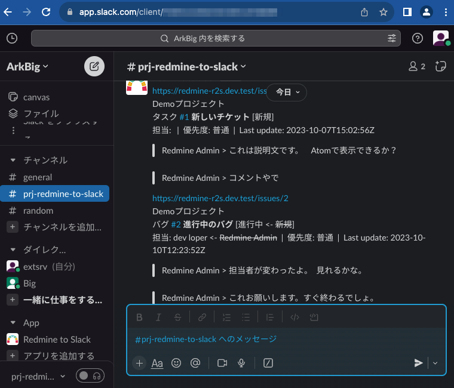
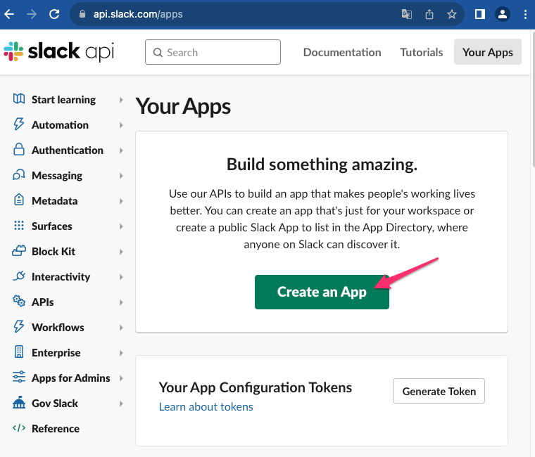
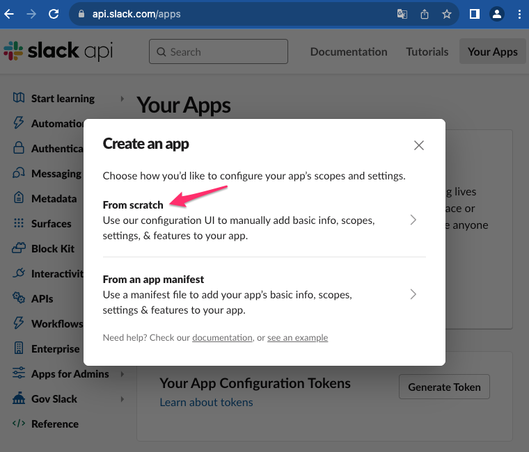
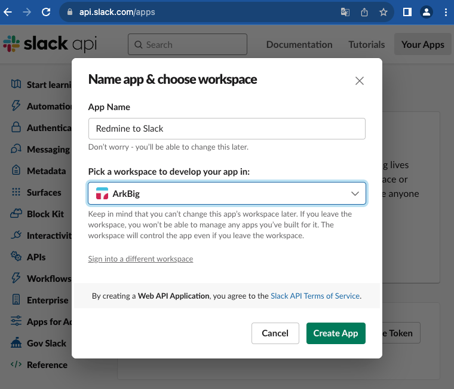
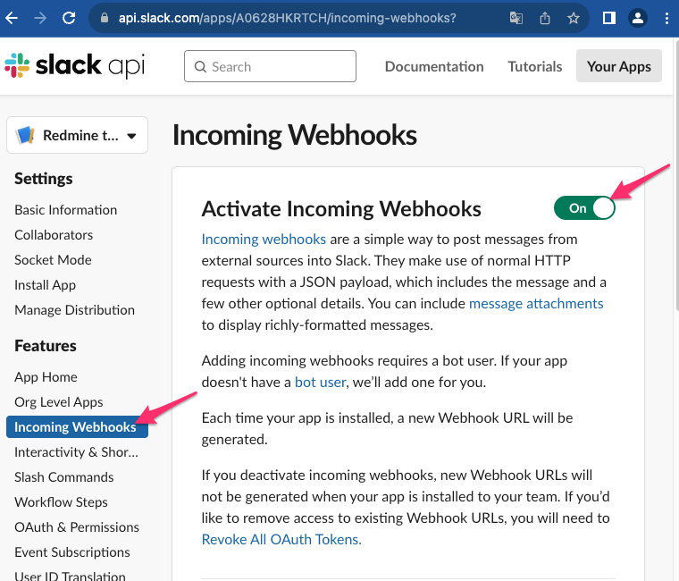
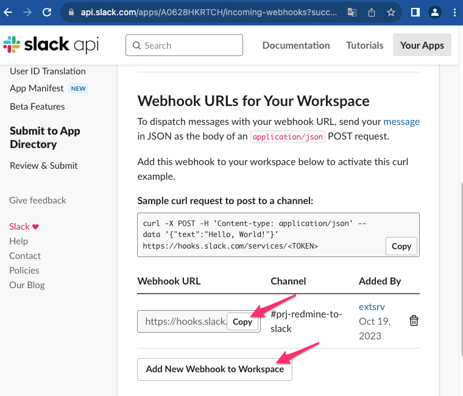
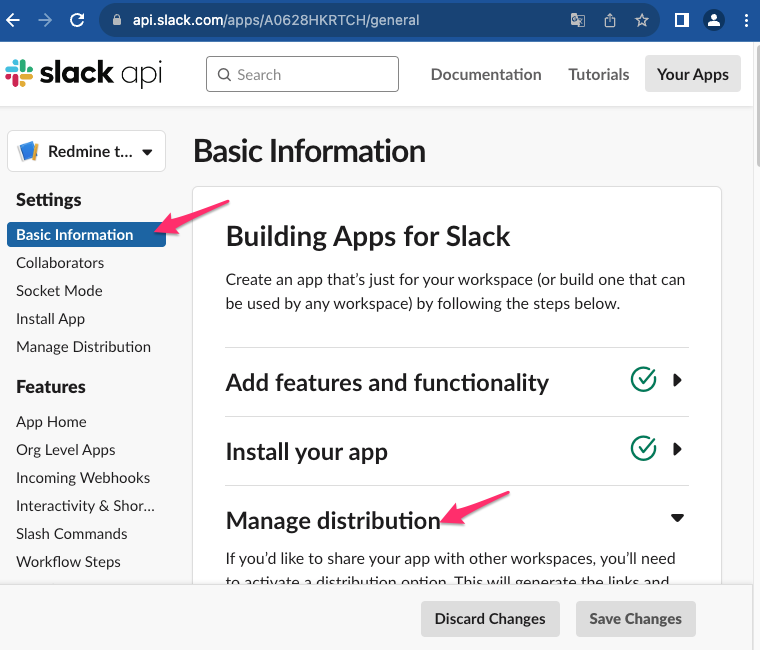
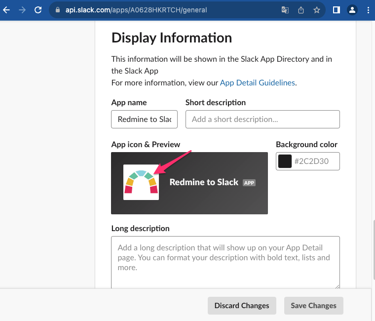

#  Redmine to Slack

This `redmine-to-slack` command subscribes to Redmine and notifies Slack.

## TODO

*This is still the first version.*

## Demo



## Key Features

- Subscribe to Redmine activity atom.
- Notify Slack.
  - Post messages can be replaced by templates (e.g., custom fields can be added)

## Motivation

I want to monitor Redmine even though I cannot install the Slack plugin on Redmine and the Slack Atom app is not available due to access source restrictions.

## Mechanism

1. {SUBSCRIBE_URL}/activity.atom is retrieved from Redmine.
   - if `--target-project` is specified, only the specified project ({SUBSCRIBE_URL}/projects/{id}/activity.atom) is retrieved.
2. Get only those that have been updated with {SUBSCRIBE_URL}/issues.json?issue_id={id(s)}.

So the default is to access Redmine twice.

## Installation

### Rust Version

MSRV: `redmine-to-slack` requires rustc 1.70.0 or newer.

### Dependent tools

redmine-to-slack uses Incoming Webhooks for Slack notifications.

<details>
<summary>How to get Slack Incoming Webhook URL </summary>

1. Go to [slack api](https://api.slack.com/apps) and create a new app.
  

2. Create an app From scratch.
  

3. Set the App Name and Workspace.
  

4. Activate Incoming Webhooks.
  

5. Scroll down and Add New Webhook to Workspace. Then you can get the Webhook URL 🎉
  

6. If you want to change the app icon, set it in Manage distribution in Basic Information.
  

7. Scroll down and upload the icon such as [docs/redmine-to-slack.png](docs/redmine-to-slack.png).
  

</details>

### redmine-to-slack

```sh
git clone https://github.com/arkbig/redmine-to-slack.git
cargo install --path redmine-to-slack
```

or Docker

```sh
docker run arkbig/redmine-to-slack --help
```

Other convenient package is available yet.

## Usage

Please use the `-h`(shortly) or `--help`(fully) option for more information.

### Basic usage

```sh
redmine-to-slack --redmine-api-key <KEY> https://redmine-r2s.dev.test https://hooks.slack.com/services/<TOKEN>
```

result:

> <https://redmine-r2s.dev.test/issues/2>  
> Demoプロジェクト  
> バグ [#2](https://redmine-r2s.dev.test/issues/2) 進行中のバグ [進行中 <- ~~新規~~]  
> 担当: dev loper <- ~~Redmine Admin~~  |  優先度: 普通  |  Last update: 2023-10-10T21:48:58+09:00  
> >Redmine Admin > 担当者が変わったよ。  見れるかな。
>
> >Redmine Admin > これお願いします。すぐ終わるでしょ。
>
> >dev loper > 2日かかります。

### Custom template

Create a template with reference to [resources/slack-notification.template](resource/slack-notification.template) and specify it with `--template-path <PATH>`.

Available variables:

- **{url}**: Issue url.
- **{local_updated_time}**: Local time of the last update.
- **{new_issue}**: Redmine issues api response. (see [Rest Issues](https://www.redmine.org/projects/redmine/wiki/rest_issues))
- **{old_items}**: Difference between response and new_issue from last time it was retrieved (empty if same).
- **{update_contents}**: List of authors and contents in RSS.

### Docker usage

By default, /app/redmine-data.json in the container stores the previously retrieved Redmine information.
If you want to make it persistent, set the volume and specify the path with `--prev-redmine-data <PATH>`.

## Roadmap

- [ ] Refactoring including command line arguments.
- [ ] Unit tests.

See the open issues for a full list of proposed features (and known issues).

## Alternative tools

`redmine-to-slack` is similar to the [RSS|Slack App](https://slack.com/apps/A0F81R7U7-rss?tab=more_info).
The extension can run on a machine that you manage and can also take the reason for the update.

## Dependencies

Direct dependencies crates:

```sh
cargo license --direct-deps-only --avoid-build-deps --avoid-dev-deps | awk -F ":" 'BEGIN {printf "|License|crate|\n|-|-|\n"} {printf "|%s|%s|\n", $1, $2}'
```

|License|crate|
|-|-|
|Apache-2.0 OR MIT (12)| anyhow, chrono, clap, humantime, proc-exit, regex, serde, serde_json, signal-hook, thiserror, tinytemplate, ureq|
|MIT (1)| feed-rs|
|Zlib (1)| redmine-to-slack|

Chain dependencies crates:

```sh
cargo license --avoid-build-deps --avoid-dev-deps | awk -F ":" 'BEGIN {printf "|License|crate|\n|-|-|\n"} {printf "|%s|%s|\n", $1, $2}'
```

|License|crate|
|-|-|
|(Apache-2.0 OR MIT) AND BSD-3-Clause (1)| encoding_rs|
|(MIT OR Apache-2.0) AND Unicode-DFS-2016 (1)| unicode-ident|
|0BSD OR Apache-2.0 OR MIT (1)| adler|
|Apache-2.0 OR Apache-2.0 WITH LLVM-exception OR MIT (1)| wasi|
|Apache-2.0 OR BSL-1.0 (1)| ryu|
|Apache-2.0 OR ISC OR MIT (4)| rustls, rustls-native-certs, rustls-pemfile, sct|
|Apache-2.0 OR MIT (82)| android-tzdata, android_system_properties, anstream, anstyle, anstyle-parse, anstyle-query, anstyle-wincon, anyhow, base64, bitflags, bumpalo, cfg-if, chrono, clap, clap_builder, clap_derive, clap_lex, colorchoice, core-foundation, core-foundation-sys, crc32fast, flate2, form_urlencoded, getrandom, heck, humantime, iana-time-zone, iana-time-zone-haiku, idna, itoa, js-sys, lazy_static, libc, log, mime, num-traits, once_cell, openssl-probe, percent-encoding, proc-exit, proc-macro2, quote, regex, regex-automata, regex-syntax, security-framework, security-framework-sys, serde, serde_derive, serde_json, signal-hook, signal-hook-registry, siphasher, syn, thiserror, thiserror-impl, tinytemplate, unicode-bidi, unicode-normalization, ureq, url, utf8parse, uuid, wasm-bindgen, wasm-bindgen-backend, wasm-bindgen-macro, wasm-bindgen-macro-support, wasm-bindgen-shared, web-sys, winapi, winapi-i686-pc-windows-gnu, winapi-x86_64-pc-windows-gnu, windows-core, windows-sys, windows-targets, windows_aarch64_gnullvm, windows_aarch64_msvc, windows_i686_gnu, windows_i686_msvc, windows_x86_64_gnu, windows_x86_64_gnullvm, windows_x86_64_msvc|
|Apache-2.0 OR MIT OR Zlib (3)| miniz_oxide, tinyvec, tinyvec_macros|
|Custom License File (1)| ring|
|ISC (2)| rustls-webpki, untrusted|
|MIT (5)| feed-rs, quick-xml, schannel, spin, strsim|
|MIT OR Unlicense (2)| aho-corasick, memchr|
|MPL-2.0 (1)| webpki-roots|
|Zlib (1)| redmine-to-slack|
-->

## License

"redmine-to-slack" is under [zlib License](./LICENSE). Please feel free to use this, but no warranty.

## Development

We have prepared [demo/compose.yaml](demo/compose.yaml) for local testing. Please start it up with `docker compose -f demo/compose.yaml up -d`.
If you set up [devbase](https://github.com/arkbig/devbase) in advance, you can start it with `redmine-to-slack https://redmine-r2s.dev.test https://echo-serv-r2s.dev.test/echo`.
